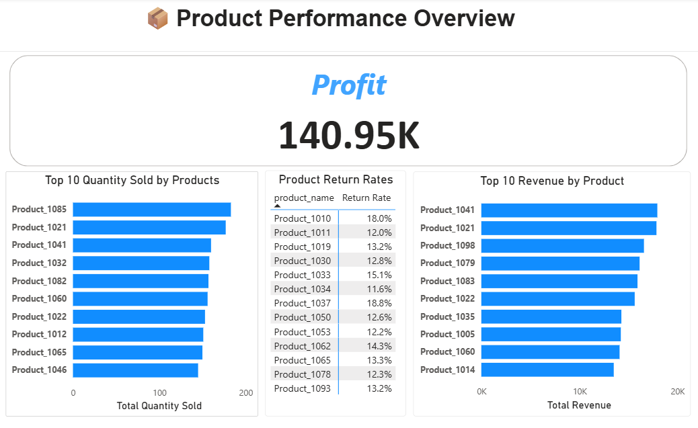
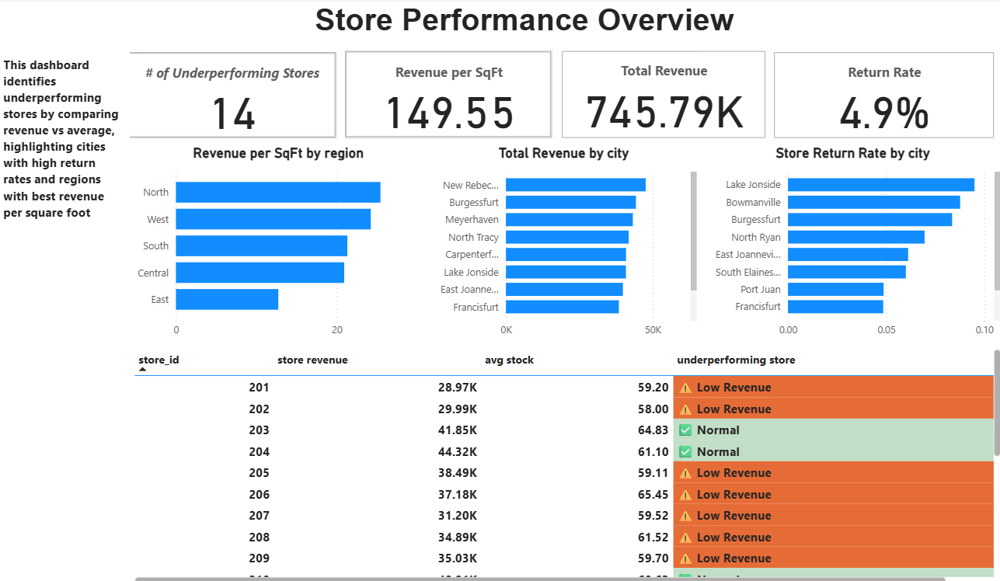
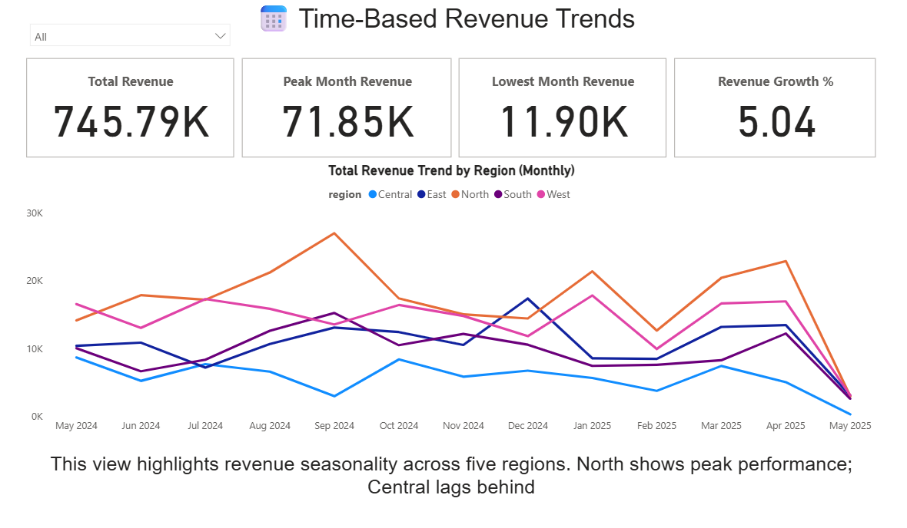

# 🛍️ Retail Data Insights with SQL & Power BI

A business-focused analytics project using SQL for data transformation and insight generation, with Power BI for visual storytelling. This project simulates a real-world scenario where a retailer wants to understand product performance, store efficiency, and operational challenges across sales, inventory, and returns.

---

## Table of Contents

- [Project Objective 📌](#project-objective)
- [Tools & Skills Used 🛠](#tools--skills-used)
- [SQL Files 📂](#sql-files)
- [Example SQL Logic 🧾](#example-sql-logic)
- [Data Sources 🗃️](#data-sources)
- [Business Challenges & Decision Goals 🎯](#business-challenges--decision-goals)
- [ETL & Modeling Approach 🔄](#etl--modeling-approach)
- [Dashboard Highlights 📊](#dashboard-highlights)
- [Power BI Visualizations 📈](#power-bi-visualizations)
- [Key Takeaways 🔍](#key-takeaways)
- [Conclusion ✅](#conclusion)
- [Contact 📬](#contact)
- [License 📝](#license)

---

## 📌 Project Objective

To help business stakeholders make informed decisions by analyzing:
- Which products drive the most revenue and profit
- Which stores are underperforming or inefficient
- How returns and inventory affect business operations
- What time-based patterns affect sales trends

---

## 🛠 Tools & Skills Used

- **SQL (MySQL Workbench)** – Joins, CTEs, aggregation, CASE logic
- **Power BI** – Dashboards, KPI cards, DAX measures, visual design
- **DAX** – Custom measures for profit, return rate, revenue per square foot
- **Excel** – Preload data review
- **Data Modeling** – Schema design and table relationships

---

## 📂 SQL Files

Explore raw SQL logic and business rules:
- [`Product Analysis`](sql/2_product-performance-analysis/)
- [`Store Performance`](sql/3_store-performance-analysis/)
- [`Advanced Insights`](sql/4_advanced-insights/)

---

## 🧾 Example SQL Logic

Here's an example query to flag underperforming stores based on revenue:

```sql
WITH store_revenue AS (
  SELECT store_id,
         SUM(quantity * unit_price * (1 - discount)) AS total_revenue
  FROM sales
  GROUP BY store_id
)
SELECT store_id,
       CASE 
           WHEN total_revenue < (SELECT AVG(total_revenue) * 0.7 FROM store_revenue)
           THEN 'Underperforming'
           ELSE 'Normal'
       END AS status
FROM store_revenue;
```
---

## 🗃️ Data Sources

This project uses five synthetic CSV datasets:
- `sales.csv` – Transaction-level records
- `products.csv` – Product cost and category info
- `stores.csv` – Store size, region, open date
- `inventory.csv` – Stock levels and restock dates
- `returns.csv` – Quantity and reasons for product returns

---

## 🎯 Business Challenges & Decision Goals
This project supports key operational and strategic decisions across the retail chain. The goal is to go beyond reporting and provide actionable insights to optimize product offerings, store performance, and inventory strategies.

📦 Product Strategy

Which products consistently drive revenue and margin, and which underperform?

Are any products generating excessive returns that signal quality or customer experience issues?

🏬 Store Optimization

Which stores are underperforming relative to the company average or regional peers?

How efficient is each store in terms of revenue per square foot and inventory turnover?

📅 Sales Planning

What are the peak and low sales periods, and how should promotions be timed accordingly?

Are there differences in weekday vs. weekend sales patterns that affect staffing or supply planning?

---

## 🔄 ETL & Modeling Approach

- Imported all CSVs into SQL and used joins/CTEs to perform calculations.
- Modeled clean, joined tables in Power BI using relationships on `product_id` and `store_id`.
- Created dynamic DAX measures for profit, return rate, average stock, and revenue efficiency.
- Used conditional formatting and card visuals to highlight business risks and opportunities.

---

## 📊 Dashboard Highlights

### ✅ Product Page
- Top 10 products by revenue and quantity
- High return rate flag
- Profit margin comparison

### ✅ Store Page
- Revenue vs. benchmark
- Revenue per square foot
- Underperforming store identification logic

### ✅ Time Trend Page
- Monthly revenue trends
- Peak vs. low performance periods
- Regional performance comparison over time

---

## 📊 Power BI Visualizations

### Product Performance Overview


### Store Performance Overview


### Time-Based Revenue Trends


---

## 🔍 Key Takeaways

✅ Transformed raw transactional data into business-ready insights using SQL and Power BI

🔍 Identified high-risk products using return rate thresholds and profitability metrics

🏬 Flagged underperforming stores based on revenue benchmarks and store efficiency (e.g., per sq. ft.)

📈 Revealed time-based trends and regional performance patterns to guide inventory and sales planning

💡 Designed dashboard for retail managers to take specific actions — restock smarter, cut loss-makers, and optimize promotions

---
## ✅ Conclusion

This project provided valuable insights into product performance, store efficiency, and operational challenges. By leveraging SQL for data analysis and Power BI for visualization, we identified key areas for improvement and strategic opportunities for the retail business.

🔧 This project mirrors real-world analytics use cases in retail — demonstrating skills beyond junior-level by connecting technical outputs to operational and strategic decision points.

---
## 📝 License

This project is licensed under the MIT License — see the [LICENSE](LICENSE) file for details.

---
## 📬 Contact

Created by **[Jake Ma]** — [[LinkedIn Profile](https://www.linkedin.com/in/jake-ma-0a4278282/)]  
Let’s connect if you’re hiring or want to discuss practical data storytelling.
